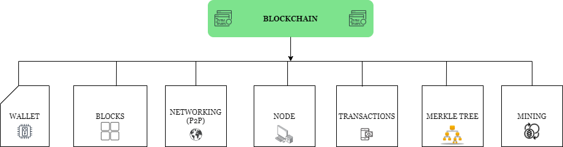
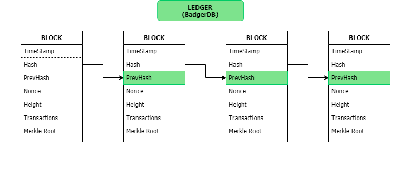
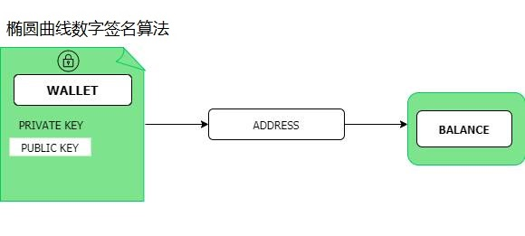
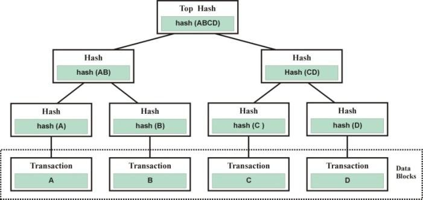
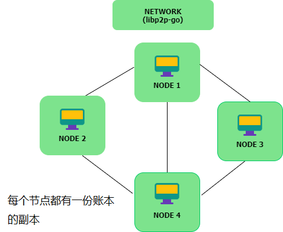

# The linechain

## online documents

[项目详解](https://6gp5wx5pb3.k.topthink.com/@vk27977rjm "呈现项目所有的细节")

## Flow Diagram

实现了区块链所需的关键功能：

- Blockchain结构
- Nodes节点
- 共识算法, Blocks & Proof Of Work (POW)
- Wallet钱包
- Transactions交易
- Uspent Transaction Output (UTXO)
- Merkle Tree
- Networking (P2P/分布式系统)网络层：p2plib
- Database：高性能数据库badger

## 文件清单

| 文件夹     | 内容                                         |
|:-----------|:-------------------------------------------------|
| `./p2p`    | 网络层    ||
| `./console`    | CLI脚本，可与blockchain交互  |
| `./wallet` | Wallet源码                            |
| `./api`| 使用Go, Python, Rust 和 JS 等编写的API封装                              |

## 关于部署

可部署在windows、linux系统的电脑上，以及任意支持交叉编译go的其它操作系统的终端，每个部署程序的都是一个全节点。
不同终端启动节点的命令参数 instanceId 可以相同。
同一个终端部署多个节点用于开发和测试用，需要使用不同的instanceId区分不同的终端。
运行节点的计算机，不需要安装第三方依赖库。

## Blockchain

Blockchain 定义为一个存储区块的数据库，在数据库中，每一个区块链接到前一个区块。

## Nodes

Nodes 可被定义为任何类型的设备（主要是计算机）, 手机, 笔记本电脑, 大数据中心。Nodes建立区块链网络基础架构，没有node就没有网络。所有nodes彼此连接，它们通常互相交换最新的区块链数据，确保所有节点保持最新。节点的主要作用包括但不限于：存储区块链数据，验证新的交易和区块，帮助新的和已经存在的节点保持最新。

区块链由三类节点组成：

### Mining Nodes

这是区块链网络中最重要的节点，他们保持网络运行，它们负责挖出新的币，它们验证交易，验证和挖出新的区块。

### Full Nodes

这类节点负责为矿工验证新的交易，管理内存池（未验证的交易），以及验证新的区块。

### Ordinary Nodes

这类节点是网络的一部分，保持网络运行，它们更多验证网络上的新节点。

### Gerneral Nodes

这类节点是网络的大多部分，保持网络运行。

本区块链支持**fullnode** 、 **mining node** 和 **gerneral node**，但只是分工不同，他们都是全节点。

### 共识算法,挖矿, 区块 与 Proof Of Work (POW)

本项目实现了Proof of work算法，POW被bitcoin和litecoin使用。

### Blocks 图表

### 我们如何知道一个区块是否合法?

我们检查两件事：

1. 我们检查前一个区块引用是否存在和合法。

2. 我们检查该区块的POW合法.

## Wallet

钱包系统类似于银行账户，包括一对公私密钥。密钥用于跟踪拥有者权属、接受和发出加密货币。
钱包系统独立于区块链网络。

### 钱包、地址与余额关联图

### Commands

这里命令参数 intanceid 请与 blockchain 的 instanceId 保持一致，以指定钱包文件的目录。

产生一个新钱包

    ./wallet new --intanceid INSTANCE_ID

打印所有本地钱包

    ./wallet print --intanceid INSTANCE_ID

根据地质打印钱包

    ./wallet print --address ADDRESS --intanceid INSTANCE_ID

### Transactions

一个交易是在钱包之间的价值传送。它由交易输入和交易输出组成。交易输入由已花费币数组组成，同时交易输出由未花费币数组组成。交易由私钥签名，以证明一个用户确实是拥有这些币。交易初始化后发送到网络，随后网络节点们使用该用户的公钥对该交易执行一序列验证。

### Memory pool

交易池是一个未确认交易的等待区。当一个用户发出了一个交易后，该交易被发送给网络上的所有全节点，全节点验证交易后，将它们放入到它们的内存池中，同时等待矿工节点拾起它，并包含到下一个区块中。

### Uspent Transaction Output (UTXO) Model

得益于bitcoin区块链，这个概念变得真正流行起来，它定义为一个区块链交易未花费的输出。

它们可用于新的交易（只要您用私钥解锁它们），这使得他们变得有用。当一个用户试着发送X数量的币给Y用户，UTXOs用作输入，该用户可以解锁它们。
计算一个钱包的balance（余额）可以通过将被特定地址锁定的所有未花费交易输出相加得到。

#### 为什么我们需要这个 ?

 balance（余额）
 区块链数据相当冗长，其大小可为从几百到几亿的数据，通过区块链计算一个用户的钱包余额相当昂贵，UTXOs作为一个拯救手段可降低费用。UTXOs不是完全聪明，但是一个进步，而每一个主意都有它的权衡。

#### 它是如何工作的？

UTXOs被存储在BadgerDB，提供特别的命令执行这个，但记住，UTXOS是从创世区块开始创建的，UTXOS是从创世区块开始的区块链中创建的，每次执行新交易时都会进行计算，并且每次用户检查其余额时和添加新区块时都会进行计算。

### Merkle Tree

Merkle树可以简单地定义为二进制哈希树数据结构，它由一组节点组成，在树的底部包含大量底层节点，这些底层节点包含基础数据，还有一组中间节点，其中每个节点都是哈希，最后也是一个由其两个子节点的哈希组成的单个根节点，称为merkle根的树的“顶部”，这使得能够快速验证区块链数据以及快速移动区块链数据。 在merkle树算法上执行事务生成单个哈希，该哈希是一串数字和字母，可用于验证给定的数据集与原始事务集相同。

### Merkle tree example

### Networking (peer-to-peer)

区块链协议在互联网上运行，在P2P网络上，计算机运行该协议，并持有相同的交易账本的副本，通过共识机制实现P2P价值交易。在计算上，p2p是一个对等网络，它可以以相同的能力（在计算方面可能有所不同）和功能来存储和共享文件。它们同时扮演服务器和客户端，实时交换信息，当一个节点扮演客户端时候，它从其它网络节点下载文件。但当他们以服务器工作时，它们成为源头，其它节点从这里下载文件。P2P网络不存在单点故障，即使在诸如容错等错误事件时依然能使系统继续正常运行。P2P网络是区块链必不可少的一个部分，因为它允许区块链数据分布于多节点/终端，防止困扰无数系统的Denial-of-Service (DoS)攻击，使他们无法接受中央机构的审查。P2P的主要局限性在于在所有同级之间保持数据一致的能力（主观），而且工作量的证明对于功能较弱的计算机而言过于计算昂贵，并且随着区块链变得更大且难度增加，这种情况只会变得更糟 这意味着具有较低计算能力的节点最终会离开，但从好的方面来说，P2P使去中心化成为可能，并为区块链提供整体安全性。

#### Network 概览

## linechain CLI

这是本项目官方的命令行工具，命令行工具允许开发者与区块链网络交互。

### Build CLI

导航到cmd/linechain目录，运行以下命令创建cli：

    go build

### 可执行的命令清单

    请注意，所有的命令，都需要加上instanceid参数

#### 产生一个新钱包.这里intanceid请与blockchain的instanceId保持一致，以指定钱包文件的目录

    ./linechain wallet new --intanceid INSTANCE_ID

#### 列出所有钱包地址.这里intanceid请与blockchain的instanceId保持一致，以指定钱包文件的目录

    ./linechain wallet listaddress --intanceid INSTANCE_ID

#### 获得余额

    ./linechain wallet balance --address ADDRESS --intanceid INSTANCE_ID

#### 打印区块链信息

    ./linechain print --intanceid INSTANCE_ID

#### 计算UTXOs

    ./linechain computeutxos --intanceid INSTANCE_ID

#### 发送

    ./linechain send --sendfrom ADDRESS --sendto ADDRESS --amount AMOUNT --intanceid INSTANCE_ID

#### 启动一个RPC服务器

默认端口是**5000**
    ./linechain --rpc true --rpcport 4000 --intanceid INSTANCE_ID

#### 开始一个节点

作为矿工
    ./linechain startnode --port PORT --address MINER_ADDRESS --miner --instanceid INSTANCE_ID

作为全节点
    ./linechain startnode --port PORT  --fullnode --instanceid INSTANCE_ID

如果这些标志在`.env`文件中已经存在，address, fullnode, miner 和 port 标志均为可选参数。

## 项目安装

### 将下面的信息添加到Env文件中(必须)

    WALLET_ADDRESS_CHECKSUM = 4

### 矿工的其它信息(可选)

    WALLET_ADDRESS_CHECKSUM = 4
    MINER_ADDRESS = <YOUR_WALLET_ADDRESS>
    MINER = true

### Start a node

#### NB: 运行多个区块链实例需要你使用--instanceid初始化一个新的区块链，随后访问该实例时候也需要用到它，区块链的数据库以instanceid命名。一个节点只有一个唯一的instanceid，该节点的所有针对区块链的操作均与其有关

#### Initialize a blockchain

这个命令创建创世区块，并初始化区块链。Instanceid允许你运行该区块链的多个实例，它必须是一个字符串，如5000
    ./linechain init --address <YOUR_WALLET_ADDERESS> --instanceid <USE_ANYTHING>

#### 在启用RPC的情况下启动区块链实例

作为矿工
    ./linechain startnode --port PORT --address MINER_ADDRESS --miner --rpc --rpcport PORT  --instanceid INSTANCE_ID

作为全节点
    ./linechain startnode --port PORT --fullnode --rpc --rpcport PORT --instanceid INSTANCE_ID

作为普通节点
    ./linechain startnode --instanceid INSTANCE_ID --rpc --rpcport PORT --instanceid INSTANCE_ID

#### 节点JSON-RPC服务器

创建钱包
示例
    curl -X POST -H "Content-Type: application/json" -d '{"id": 1, "method": "API.CreateWallet", "params": []}' <http://localhost:5000/_jsonrpc>

获得余额
示例

    curl -X POST -H "Content-Type: application/json" -d '{"id": 1, "method": "API.GetBalance", "params": [{"Address":"1EWXfMkVj3dAytVuUEHUdoAKdEfAH99rxa"}]}' http://localhost:5000/_jsonrpc

得到区块链
示例

    curl -X POST -H "Content-Type: application/json" -d '{"id": 1,"method": "API.GetBlockchain", "params": []}' http://localhost:5000/_jsonrpc

通过Height得到区块
示例

    curl -X POST -H "Content-Type: application/json" -d '{"id": 1,"method": "API.GetBlockByHeight", "params": ["Height":1]}' http://localhost:5000/_jsonrpc

发送
示例

    curl -X POST -H "Content-Type: application/json" -d '{"id": 1 , "method": "API.Send", "params": [{"sendFrom":"1D214Jcep7x7zPphLGsLdS1hHaxnwTatCW","sendTo": "15ViKshPBH6SzKun1UwmHpbAKD2mKZNtBU", "amount":0.50, "mine": true}]}' http://localhost:5000/_jsonrpc

#### 命令行用法

    用法:
    linechain [flags]
    linechain [command]

    可用Commands:
        computeutxos 重建和计算Unspent transaction outputs
        help         关于任何命令的帮助
        init         初始化区块链并创建创始区块
        print        打印区块链里面的区块信息
        send         从本地钱包地址发送X数量的币给一个地址
        startnode    开始一个节点
        wallet       管理钱包

    Flags:
            --address string      钱包地址
        -h, --help                linechain命令帮助
            --instanceid string   节点实例ID（所有命令都必须加此参数）
            --rpc                 启用HTTP-RPC server
            --rpcaddr string      HTTP-RPC server监听地址 (默认:localhost)
            --rpcport string       HTTP-RPC server监听端口(默认: 5000)

    使用 "linechain [command] --help" 得到特定命令的更多信息

## 挑战

本区块链项目没有解决分叉问题[fork](https://en.wikipedia.org/wiki/Fork_(blockchain))；此外，还没没有实现节点内存池，这反过来又影响了在系统中拥有多个挖矿节点和全节点的能力。

## 下一步

- 改善Memorypool和Mining的实现
- 节点内存池
- 虚拟机（运行智能合约）
- 测试覆盖
- 改善错误处理
- 脚本语言支持（智能合约支持，初步考虑集成以太坊的智能合约模块）
- 解决分叉问题（fork）
- 节点内存池
- 验证节点（轻节点）
- 挖矿节点（轻节点）
